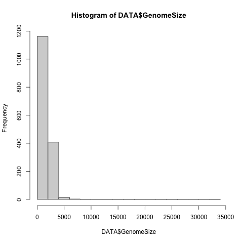
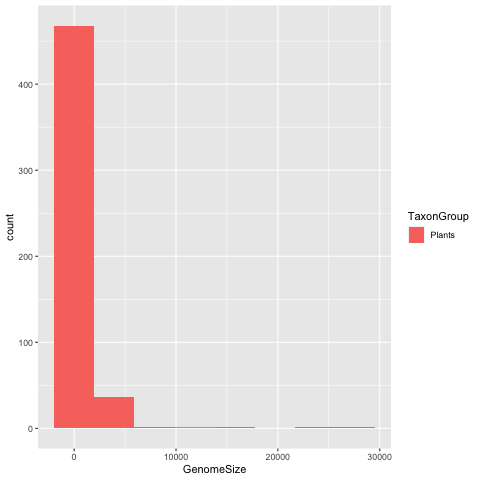
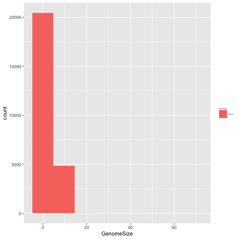
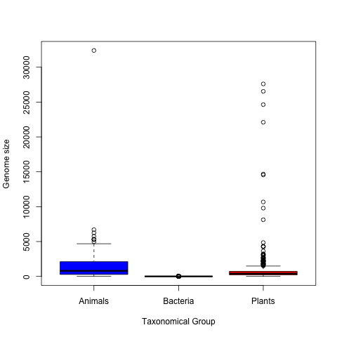

---
### BEGIN-Of-YAML-Block ###
#
## ######################################################################################
##
##   README_BScBICG2021_exercise00_SURNAME_NAME.md
##
##   A LaTeX-extended MarkDown template for BScBI-CG practical exercise submissions.
##
## ######################################################################################
##
##                 CopyLeft 2020 (CC:BY-NC-SA) --- Josep F Abril
##
##   This file should be considered under the Creative Commons BY-NC-SA License
##   (Attribution-Noncommercial-ShareAlike). The material is provided "AS IS",
##   mainly for teaching purposes, and is distributed in the hope that it will
##   be useful, but WITHOUT ANY WARRANTY; without even the implied warranty
##   of MERCHANTABILITY or FITNESS FOR A PARTICULAR PURPOSE.
##
## ######################################################################################
#
# The current execise number
thyexercise: 00
#
# title-meta is title string without any LaTeX format to be used as pdftitle, part of emails subject...
title-meta: BScBI-CG Exercise 00
#
# title is the big title for the cover page, fully LaTeX formated to fit into a shortstack command...
title: |
  \textsc{BScBI-CG}
  \vskip 1.25ex \textsc{Practicals}
  \vskip 1.25ex \textsc{Report}
#subtitle:
#
# runtitle is the running header or footer, used i.e. by fancyheadings...
runtitle: |
  BScBI-CG Exercise 00 Report
#
# author-meta sets the pdfauthor variable...
author-meta: !!str 'Name SURNAME @ BScBI Computational Genomics'
#
# authors to appear on the title page...
author:
- name: ADRIA CABELLO
  myemail: adrian.cabello
  mydomain: alum.esci.upf.edu
# you can follow the example below
# we need to define email as two fields (user/domain) to avoid parsing email by YAML
# - name: Josep F Abril
#   myemail: jabril   #
#   mydomain: ub.edu  # the real complete email address was in this case: jabril@ub.edu
#
# authorshort defines a brief list of authors for headings, i.e.: Abril, JF
authorshort: Cabello, A.
#
# template formating variables...
papersize: a4paper
fontsize: 10pt
geometry: margin=1.5cm
toc: true
lof: true
lot: true
colorlinks: true
urlcolor: blue
citecolor: green
linkcolor: red
#
# LaTeX definitions (available for the main document)
further-defs:
-  \def\CGVC{\href{https://aula.esci.upf.edu/course/view.php?id=5915}{Computational Genomics Virtual Campus at ESCI}}
#
### End-Of-YAML-Block ###
---

\begin{comment}
The \texttt{comment} \LaTeX\ environment allow us to include any piece of text, code, etc, but it wil not be included into the final PDF report when compiling the \texttt{MarkDown} file. You can open/close one of such environments at any time if you need them.
\end{comment}


# Introduction

We are going to reuse a set of existing `MarkDown` report templates to define the protocols to be run on each practical session. This first document will allow us to describe the different sections it contains, highlighting the major blocks its made of. We will also use it to provide applied examples of the `MarkDown` and \LaTeX\ syntax; for both we will introduce new features on each new practical session. You can read the [`MarkDown` syntax guide](http://daringfireball.net/projects/markdown/syntax#link), as well as from the manual pages (just type `man pandoc` and/or `man pandoc_markdown` if you have installed this software tool).


## Objectives

* We will practice how to report the commands and the results required to solve the practical exercises, using a text file, this report of course, and the `MarkDown` syntax. Some enhancements using \LaTeX\ will be also illustrated.
* The main goal is to understand the structure and logic of the report document, what can be found on each section, how code blocks are defined, and how to process it for submission to the \CGVC.
* This exercise will be useful to check that all required packages and libraries are working properly in order to generate the practical reports for the continued assessment of the subject.
* At the same time, if those commands can run on our computers, we will have some commands already installed and available for the forthcoming practical sessions.


## Prerequisites

### Installing required software

For this practical we must ensure that at least `pandoc` and `pdflatex` commands are running smoothly over our report files. You probably may need to install the following packages before working on anything else.

#### __Linux__ users:

You must submit an exercise report for each practical as two single files, a `MarkDown` text file and a `PDF` compiled from that `MarkDown` file. In order to run such procedure, we must ensure that we have the software tools and the corresponding dependencies. This has to be done for the first exercise only, as you will have those tools already available for future compilations of the other exercises. The command below will install those tools:

```{.sh}
sudo apt-get install pandoc \
                     texlive-latex-recommended \
                     texlive-latex-extra \
                     texlive-fonts-recommended

# getting the latest version from repository
#     https://github.com/jgm/pandoc/releases/latest
# for a Debian-based linux distribution you can run those two commands:
wget https://github.com/jgm/pandoc/releases/download/2.10.1/pandoc-2.10.1-1-amd64.deb
sudo dpkg -i pandoc-2.10.1-1-amd64.deb
```

When using `pandoc` version greater than `2.x` we will be able to apply further macros and tags on our report file (like embed `LaTeX` blocks). In case you want to play with \LaTeX\, I will recommend you to install the complete set with this command (it takes some time to download them though, as you may get the packages and many dependencies):

```{.sh}
sudo apt-get install texlive-full \
                     texlive-fonts-recommended \
                     texlive-fonts-extra
```

You can also install optional packages, such a text editor with programming facilities and extensions, like `emacs` or `geany` (you can also use `sublime`, `atom`, `gedit`, ...):

```{.sh}
sudo apt-get install emacs geany vim vim-gtk
```

Further instructions will be given on the templates in case a practical requires that you install further software...

#### __MacOS__ users:

MacOS users can try to install ports for the software tools from `homebrew` or `conda` repositories. Here we have a brief summary of such commands. `Homebrew` is a package manager for __MacOS__; it also has a port for __Linux__, known as `Linuxbrew`. To install this package manager, just copy the following command and paste it to a Terminal window:

```{.sh}
# setting up brew tool and its repositories
/usr/bin/ruby -e "$(curl -fsSL https://raw.githubusercontent.com/Homebrew/install/master/install)"
```

A list of all the available packages (known as *formulae*) is found at [formulae.brew.sh](https://formulae.brew.sh). Examples of `brew` command to install the `EMBOSS` or the `pandoc` are shown here:

```{.sh}
# Getting EMBOSS installed with brew
brew search emboss
# homebrew/science/emboss  #<-- check the output of the previous command to use in your system
brew install homebrew/science/emboss

# Getting pandoc installed with brew
brew install pandoc
# this is optional
brew install pandoc-citeproc
# you need this to typeset PDFs with LaTeX
brew install librsvg python homebrew/cask/basictex

# You can also download the pandoc MacOS instaler from the following URL:
# https://github.com/jgm/pandoc/releases/download/2.10.1/pandoc-2.10.1-macOS.pkg
```

#### Using `docker` containers:

If you have a MacOS, a MS-Windows OS, or you cannot deal with the software install commands from the previous section, you can even use the container we provide for the course, which has all those tools already packed and ready to be used.

```{.sh}
# You must install docker server to run containers in your system. Follow the instructions from the URLs below
#    https://docs.docker.com/
#          https://docs.docker.com/install/linux/docker-ce/debian/
#          https://docs.docker.com/docker-for-mac/install/
#          https://docs.docker.com/docker-for-windows/install/

# Then, get the tarball unzipped on your machine:
gunzip -vc '/mounted_device_path/MScGGBIA_docker.tar.gz' > ~/MScGGBIA_docker.tar

#  Upload the container to your docker server:
docker load -i ~/MScGGBIA_docker.tar

# Change directory on the current terminal/shell to the exercise folder.

# Run this docker with:
docker run --rm -ti -e WD="$PWD" -v /home:/home   mscggbia    # on a Linux   machine
docker run --rm -ti -e WD="$PWD" -v /Users:/Users mscggbia    # on a Mac     machine
docker run --rm -ti -e WD="$pwd" -v c:/Users:/Users mscggbia  # on a Windows machine

# Now you will be inside the container on the root folder,
# so you have to change to the working directory:
cd $WD
# Then you are ready to play with commands at the exercise folder.
source projectvars.sh
runpandoc
```


### Initializing the main report files

In a `bash` command-line terminal, create a folder for all the practicals on this subject and change working dir to that folder:

```{.sh}
mkdir practicals
cd practicals
```

Then, we need to download the exercise tarball (the `*.tgz` file) from the \CGVC\ into that folder, unpack such file, modify the files accordingly to the user within the exercise folder, and set it as the current working directory for the rest of the practical session...

```{.sh}
# Uncompress and unpack the exercise files from tarball
#
# NOTE: If you are reading this, you probably have already done this step.
#
tar -zxvf BScBI_CG2021_exercise_00.tgz

# Move into the new extracted folder
cd exercise_00

# Rename the MarkDown README_*.md file by replacing NAME and SURNAME strings
# with your "NAME" and "SURNAME" with the following command
mv -v README_BScBICG2021_exercise00_SURNAME_NAME.md \
      README_BScBICG2021_exercise00_YourSurname_YourName.md

# Open exercise files using your text editor of choice
# (for instance vim, emacs, gedit, sublime, atom, ...);
emacs  projectvars.sh \
       README_BScBICG2021_exercise00_YourSurname_YourName.md

# Fix "NAME" and "SURNAME" placeholders on those files
# and save the changes before continuing.

# Load the bash definitions from projectvars.sh
source projectvars.sh
# for instance the variable WDR was set to the absolute path
# to current exercise working directory
echo $WDR

# Now you are ready to start the practical by looking at
# the MarkDown file for further instructions to run
# the corresponding code blocks.

# Each time you include your answers/code/results
# on the README file, you can compile it into PDF.
# So that, let's tests if we can compile the modified MarkDown document.
# You probably must install some dependencies yet...
runpandoc
```

Again, remember to submit both files, the MD and the PDF, to the \CGVC\, once errors/warnings have been fixed, all the requested task have been completed, and you have discussed your results on the corresponding sections.

If you have succeeded on the software installation step, then you can start with the analyses provided on the next section... May the shell be with you...

\newpage

# Genome properties Comparison

As an example of analysis we can record in a `MarkDown` report file, we are going to plot the distribution of lengths for a set of eukaryotic organisms.

## Datasets

We already have a file in tabular format in the `stats` folder, where we have saved some whole-genome properties of several eukaryotic species. The initial `genomes.csv` file was downloaded from the [Genome Information by Organism online resource](https://www.ncbi.nlm.nih.gov/genome/browse#!/overview/) at [NCBI-Genomes database division](https://www.ncbi.nlm.nih.gov/genome/). The file has info about species, their taxonomic group, the genome size in mega-basepairs (Mbp), number of completed chromosomes and organelles, as well as the number of available assemblies at NCBI, for a total of 47,345 species.

## Basic data checks from command-line

We can take a look to the `genomes.csv` file contents with some basic __Unix__ comands. We will filter out some fields and records, then we will upload the processed table into an R shell and we will transform the data into few summary plots.

```{.sh}
## listing directory contents
ls -alFhrt stats/
# drwxr-xr-x 2 jabril users 4.0K Oct  2 12:24 ./
# drwxr-xr-x 6 jabril users 4.0K Oct  2 12:01 ../
# -rw-r--r-- 1 jabril users 4.0M Oct  2 12:23 genomes.csv

## counting number of lines, words and chars of a file
wc stats/genomes.csv
#  47346  168801 4188633 stats/genomes.csv
# this means that the file has 47346 lines;
# the first one defines the column names,
# thus there are 47345 records with genomes information

## looking a the first two lines of the tabular file in csv format
head -2 stats/genomes.csv
# #Organism Name,Organism Groups,Size(Mb),Chromosomes,Organelles,Plasmids,Assemblies
# "'Brassica napus' phytoplasma","Bacteria;Terrabacteria group;Tenericutes",0.743598,0,0,0,1

## filtering out relevant information
gawk 'BEGIN{ FS=","; OFS="\t"; }
  { gsub(/\"/, "", $2);
    split($2, t, ";");
    print $1, t[1], t[2], $3, $4;
  }' stats/genomes.csv \
   > stats/genomes.tbl

## looking a the first two lines of the new tabular file in tsv format
head -2 stats/genomes.tbl
# #Organism Name	Organism Groups		Size(Mb)	Chromosomes
# "'Brassica napus' phytoplasma"	Bacteria	Terrabacteria group	0.743598	0

# just focus on animal genomes
gawk 'BEGIN{ FS=OFS="\t"; }
      $2 == "Eukaryota" && $3 == "Animals" {
        print $0;
      }' stats/genomes.tbl \
       > stats/genomes.animals_only.tbl

# yet another counting step
wc stats/genomes.*
#   47346  168801 4188633 stats/genomes.csv
#   47346  342343 3009831 stats/genomes.tbl
#    1586    9517   78544 stats/genomes.animals_only.tbl
```

## Visualizing the analysis

Let's explore the distribution of genome lengths in animal genomes. By running `R` command, we enter in the `R` shell interpreter, which understands `R` commands of course.

```{.sh}
R
#
# R version 3.5.2 (2018-12-20) -- "Eggshell Igloo"
# Copyright (C) 2018 The R Foundation for Statistical Computing
# Platform: x86_64-pc-linux-gnu (64-bit)
#
# R is free software and comes with ABSOLUTELY NO WARRANTY.
# You are welcome to redistribute it under certain conditions.
# Type 'license()' or 'licence()' for distribution details.
#
# R is a collaborative project with many contributors.
# Type 'contributors()' for more information and
# 'citation()' on how to cite R or R packages in publications.
#
# Type 'demo()' for some demos, 'help()' for on-line help, or
# 'help.start()' for an HTML browser interface to help.
# Type 'q()' to quit R.
```

Now, we must load the tabular data into a variable.


```{.r}
# if we have an uncompresed tabular file
DATA <- read.table("stats/genomes.animals_only.tbl",
                    header=FALSE, comment.char='#',
                    col.names=c("SpeciesName","Superkingdom","TaxonGroup",
                                "GenomeSize","ChromNum"));

# just checking the data structure
head(DATA, 4)
                  SpeciesName Superkingdom TaxonGroup GenomeSize ChromNum
1          Acanthaster planci    Eukaryota    Animals   383.8600        0
2        Acanthisitta chloris    Eukaryota    Animals  1035.8800        0
3    Acanthochaenus luetkenii    Eukaryota    Animals   545.7590        0
4    Acanthocheilonema viteae    Eukaryota    Animals    77.3509        0
```

Let's calculate some stats on the dataset.

```{.r}
options(width=180)
summary(DATA)
#                       SpeciesName      Superkingdom    TaxonGroup     GenomeSize         ChromNum
#  Acanthaster planci         :   1   Eukaryota:1586   Animals:1586   Min.   :    0.0   Min.   : 0.000
#  Acanthisitta chloris       :   1                                   1st Qu.:  284.0   1st Qu.: 0.000
#  Acanthochaenus luetkenii   :   1                                   Median :  801.1   Median : 0.000
#  Acanthocheilonema viteae   :   1                                   Mean   : 1191.8   Mean   : 2.373
#  Acanthochromis polyacanthus:   1                                   3rd Qu.: 2111.3   3rd Qu.: 0.000
#  Acartia tonsa              :   1                                   Max.   :32396.4   Max.   :59.000
#  (Other)                    :1580
```

Now, let's make an histogram of total lengths for the animal genomes:

```{.r}
png(file="images/genome_length_animals.png");
hist(DATA$GenomeSize);
dev.off();
```



## Further analyses

You can provide here the `bash` and `R` commands to generate the genome sizes histograms for plants and bacteria (archea not included). If you were able to perform and complete that task, you can play with the data after that and provide box-plots by taxonomic group showing the distribution of the genome sizes side-by-side.

```{.r}
# Your shell commands here
gawk 'BEGIN{ FS=OFS="\t"; }
$2 == "Eukaryota" && $3 == "Plants" {
print $0;
}' stats/genomes.tbl \
> stats/genomes.plants_only.tbl


gawk 'BEGIN{ FS=OFS="\t"; }
$2 == "Bacteria" && ( $3 == "Terrabacteria group" || $3 == "Proteobacteria" || $3 == "unclassified" ) {
print $0;
}' stats/genomes.tbl \
> stats/genomes.bacteria_only.tbl

```

```{.r}
plants <- read.table("stats/genomes.plants_only.tbl",
                    header=FALSE, comment.char='#',
                    col.names=c("SpeciesName","Superkingdom","TaxonGroup",
                                "GenomeSize","ChromNum"), sep = '\t');
bacteria <- read.table("stats/genomes.bacteria.tbl",
                    header=FALSE, comment.char='#',
                    col.names=c("SpeciesName","Superkingdom","TaxonGroup",
```                               "GenomeSize","ChromNum"), sep = '\t');

```{.r}
#png(file = "images/plants.png")
ggplot(plants, aes(GenomeSize, fill = TaxonGroup)) + geom_histogram(aes(y = stat(count) ), bins = 8, show.legend = TRUE)
#dev.off()
```


```{.r}
#png(file = "images/bacteria.png")
ggplot(bacteria, aes(GenomeSize, fill= TaxonGroup)) +geom_histogram(aes(y = stat(count) ), bins = 8, show.legend = TRUE) + theme(legend.title = element_text(size = 3),
               legend.text = element_text(size = 3))
#dev.off()
```


```{.r}
bacteria$TaxonGroup <- "Bacteria"
merge <- do.call(rbind, list(DATA,plants, bacteria))
#png(file = "images/merge.png")
boxplot(merge$GenomeSize~merge$TaxonGroup, xlab = "Taxonomical Group", ylab = 'Genome size', col = c('blue','green','red'))
#dev.off()

```



# Discussion
\label{sec:discussion}

__IMPORTANT__ Discuss your results here (around 300 words). And remember to include in the Appendices section (see page \pageref{sec:appendices}), any extra script you wrote from this exercise `bin` folder using the `loadfile` macro.

:: **YOUR DISCUSSION OF RESULTS HERE** ::

Firstly, we can start talking about the boxplot comparing animals, plants, and bacteria. We can state that in general, the more complex the organism is the more tend to have a bigger genome size. The distribution for plants and animals is more or less the same arround 8000 mbp, while bacteria is smaller 15 mbp. Also, we can see that there are more outliers for plants and animals than bacteria.

From the evolution, we know the complexity of the animals as organism. Other organisms, like bacteria, can have more than one copy of its genome and use it in different ways (more variability).

In prokaryotes (bacteria in our case), in general we can state that there exist a linear relationship between genome size and the number of genes. However, in eukaryotes we cannot say the same, there is no correlation between the complexity of an organism and its genome, and it is called as the C-value paradox.


References:

- The size of the genome and the complexity of living beings: A. Latorre and F. J. Silva: https://metode.org/issues/monographs/the-size-of-the-genome-and-the-complexity-of-living-beings.html#:~:text=The%20genome%20of%20an%20organism,including%20genes%20and%20intergenic%20regions.&text=However%2C%20in%20eukaryotes%20there%20is,as%20the%20C%2Dvalue%20paradox.

\clearpage

# Appendices
\label{sec:appendices}

## Software

We have used the following versions:

```{.sh}
uname -a
# Linux cocoon 4.19.0-4-amd64 #1 SMP Debian 4.19.28-2 (2019-03-15) x86_64 GNU/Linux

R --version
# R version 3.5.2 (2018-12-20) -- "Eggshell Igloo"
# Copyright (C) 2018 The R Foundation for Statistical Computing
# Platform: x86_64-pc-linux-gnu (64-bit)
```


## Supplementary files
\label{sec:supplfiles}

### Project specific scripts

\loadfile{an\_script\_example.pl}{bin/an_script_example.pl}{prg:scriptexamplePERL}


### Shell global vars and settings for this project

\loadfile{projectvars.sh}{projectvars.sh}{prg:projectvarsBASH}


## About this document

This document was be compiled into a PDF using `pandoc` (see `projectvars.sh` from previous subsection) and some `LaTeX` packages installed in this linux system. `synaptic`, `apt-get` or `aptitude` can be used to retrieve and install those tools from linux repositories. As the `raw_tex` extension has been provided to the `markdown_github` and `tex_math_dollars` formats, now this document supports inline \LaTeX\ and inline formulas!

You can get further information from the following links about the [Mark Down syntax](http://daringfireball.net/projects/markdown/syntax#link), as well as from the manual pages (just type `man pandoc` and/or `man pandoc_markdown`).
